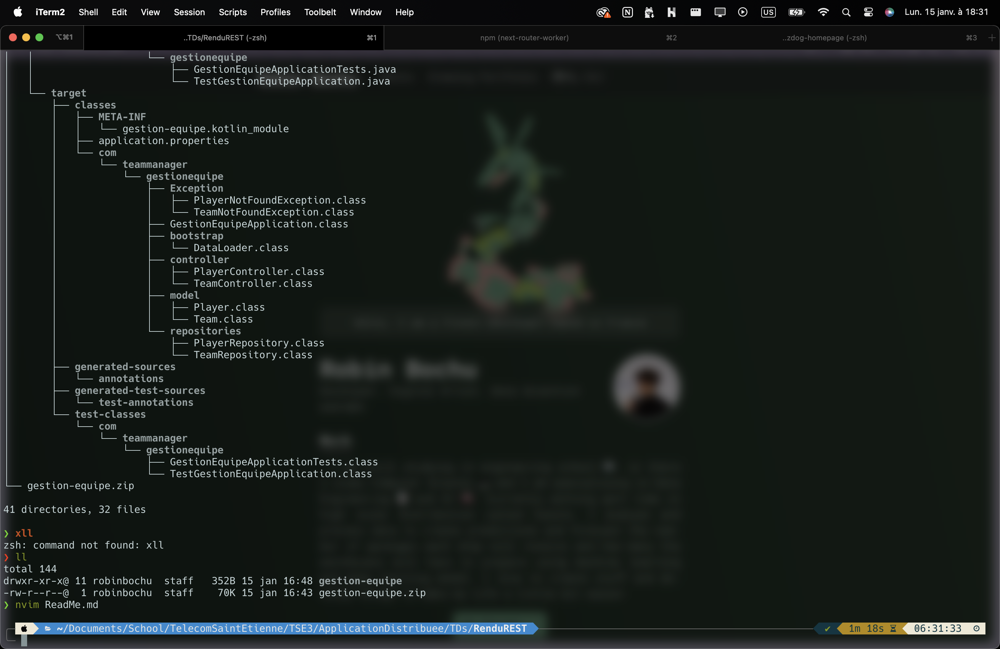
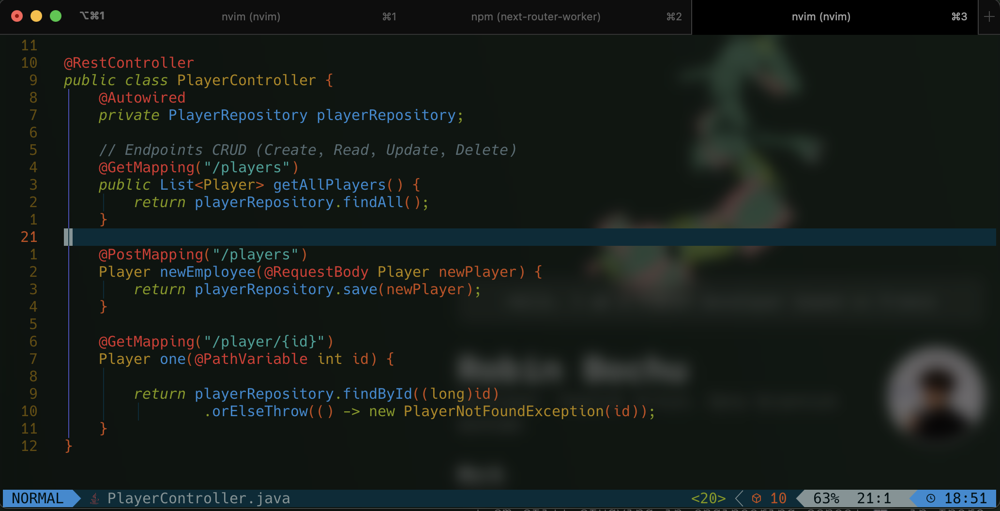

# Rendu Rest Spring Boot

## Initialisation du projet

Plusieurs étapes sont nécessaires pour l'initialisation du projet.

1. Création du projet en allant sur spring initializr pour télécharger toutes les dépendances nécessaires au projet.
2. Utilisation de :

- Kit webest
- Test
- data-jpa
- base de données H2

3. Création d'un repository **Git** pour le projet.
4. C'est partie, on peut commencer

## Hiérarichie des fichiers

</img>
Nous pouvons voir que notre application est composé de plusieurs package pour une meilleur organisation.

- **Model** : Contient les différentes entité de l'application
  - Player ➡️ id, prenom, nom, age
  - Team ➡️ id, name, city
- **Controller** : Contient les controlleurs de l'application qui vont nous permettre de pouvoir récupérer les requêtes http faites par le client, et appeler les interfaces présentes dans le package **Repositories**. Les controllers permettent la gestion de chaque actions prises en charge par une API REST : (POST, PUT, GET, DELETE...)
  </img>

- **Repository** : Contient les repositories de l'application qui vont permettre d'utiliser les procédures extraitent de JpaRepository pour ramener les informations par rapport à l'ID de nos entités.
- **Bootstrap** : Contient le **Bean** de démarrage qui va apeler la fonction **Run** qui est un service qui va s'éxecuter au démarrage de notre application, celle-ci va envoyer des données directement dans la base de données que l'on pourra retrouver avec notre application
